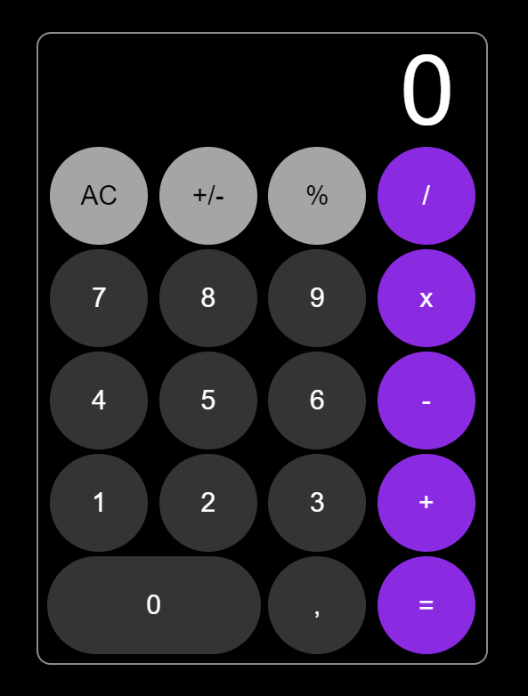

## Introdução

Este projeto é uma calculadora simples criada com HTML, JavaScript e CSS. Foi desenvolvido como parte de aprendizado dessas tecnologias, com foco especial na interação entre botões usando JavaScript, tendo as funções de soma, subtração, multiplicação e divisão.

Clique [aqui](https://github.com/justtlog/iOS-Style-Calculator) para ver o projeto.

## Dificuldades Enfrentadas

A parte mais desafiadora foi limitar o número de características da calculadora para evitar erros no layout. Além disso, encontrei dificuldades com cálculos lógicos, como a subtração e a soma combinadas com porcentagens, o que resultou em erros nos resultados finais.

##Testes Realizados

Realizei testes abrangentes com todos os cálculos possíveis que um usuário casual poderia realizar e obtive sucesso em todos eles. Todos os cálculos foram corretos e funcionaram conforme esperado.
(Exemplos:"2+2+2+4=10; 15-10-2=3" e etc...)

## Tecnologias Utilizadas 

  

## Nome Dos Participantes Do Grupo

- Wilson Neto, Paulo Iago, Carlos Eduardo, Eduardo Araujo e Gustavo Felicio.
